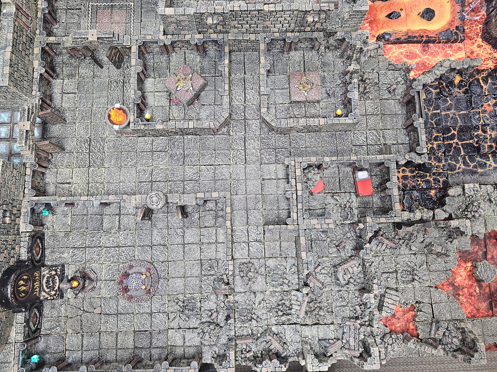
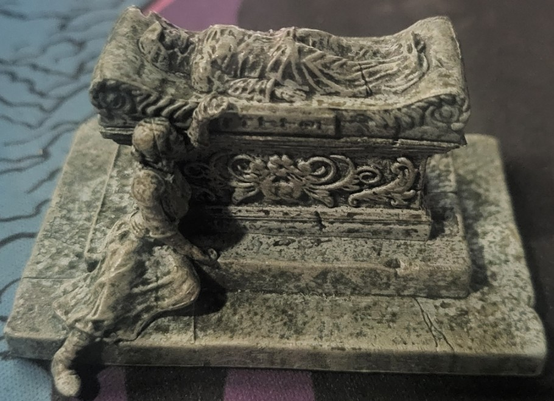

# Crypts



## Monsters

- Skeletons
- Wraiths
- 

## Puzzle ( Black Necromany Crystal )



The **kneeling mourner beside the stone figure** gives this a natural theme: a grieving person’s final words. I’d make the inscription a five-line lament, with the first letters forming the combination.

```Keep
Keep close the ring I gave to thee.
Though death has claimed thy hand from me.
Remember spring before the snow.
Where roses bloomed, now shadows grow.
Beneath this stone, my heart lies low.

What grief conceals, its beginnings reveal.
```

**Cryptex combination: GRIEF**

The last sentence hints at taking the  **beginning of each of the five lines** , read from top to bottom. Keep that sentence visually separated beneath the poem so it isn’t mistaken for a sixth line.
