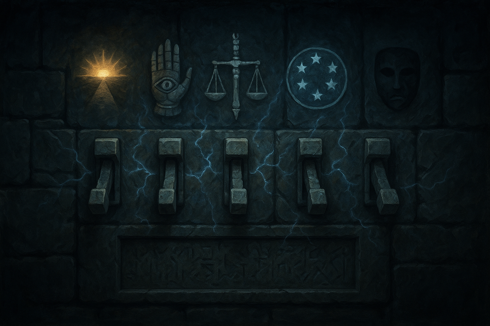

# The Gauntlet


## Traps and Key Locations

### **Trick Trap | Because I'm an asshole**

* Hidden spike trap in floor 10' x 10'.. The players have a DC13 Perception, passive unless they're specifically saying their looking for traps or stuff, then do a group perception check (two or three people roll take the average). The trick is that if the players get across, there is a second trigger that causes a the ceiling to swing down over the squares behind the trap, pushing anyone in the 10' behind the trap into the pit trap.. 25' drop (2d6+10 | covers fall and poky sticks dmg)

> To climb out  requires a check without rope (Athletics or STR DC 15).. If using rope with someone holding the end -  no check required.

### **Acid Spray Tap**

* As the first player rounds the corner the wall sprays acid over the entire 10x20 sqft area like a wall shower.. It does 2d8+2 (Reflex Save for half dmg). The players have DC13 to detect the small holes in the wall to indicate the spray trap..
* It can be disabled using slight of hand check (DC 15) | Failed roll triggers it - the only place to disable is the top square next to the spray wall.

### **Javalin Trap**

* Every 10' have players roll dex save (if roll is Odd number they don't trigger anything).. On a roll of **even** number triggers javelin that slices out the ground for 1d6+1 dmg (apply save player rolled)
* No option to disable these traps

### **Flame Trap 1 and 2**

* Flame Trap 1d6+1 / Dex Save.
* It can be disabled using slight of hand check (DC 15)

### **Lightening Trap**

* The lightening trap triggers before the players reach it, so they are aware of it... Along the wall south of were they enter the area is a set of switches..

#### The Five Seals

The wall has **five heavy stone switches** arranged horizontally. Above each switch is a symbol:



Below them is an inscription:

```
The gods have no need of names. Know them by their signs.

“First, he who slept ten years within a blade, then rose to take the throne of his enemy.”
“Second, he whose greatest dawn brought calamity even unto the gods.”
“Third, he who became the blade by which Murder itself was slain.”
“Fourth, he who alone remained divine when heaven cast the gods to earth.”
“Last, she who bore another name before inheriting the mantle of magic.”


Order	God	What the clue actually references
1	Kelemvor	Mortal Kelemvor Lyonsbane was killed by Cyric and his soul became trapped inside Godsbane—which was actually Mask. His soul remained imprisoned for roughly ten years before he emerged during the revolt against Cyric and became Lord of the Dead.
2	Lathander	The Dawn Cataclysm, Lathander's disastrous attempt to reshape the Faerûnian pantheon. Several deities were killed as a consequence.
3	Mask	During the Time of Troubles, Mask assumed the form of the sentient sword Godsbane. Cyric wielded it to kill Bhaal, Lord of Murder.
4	Helm	When Ao cast the gods down during the Time of Troubles, Helm alone retained his divine powers so he could guard the Celestial Stairway. He later destroyed the former Mystra when she tried to force her way past him.
5	Mystra	The current incarnation of Mystra was formerly the mortal wizard Midnight, who was elevated by Ao after the previous Mystra was destroyed.
```

Religion Check Clues:

| Inscription                                                             | DC 10–12                                                                                     | DC 15                                                                                          | DC 18–20                                                                                |
| ----------------------------------------------------------------------- | --------------------------------------------------------------------------------------------- | ---------------------------------------------------------------------------------------------- | ---------------------------------------------------------------------------------------- |
| **“He who slept ten years within a blade…”**                   | You recall a tale of a mortal soul being imprisoned inside a divine weapon.                   | The weapon was**Godsbane** , a sentient blade associated with Cyric.                     | The imprisoned soul was**Kelemvor Lyonsbane** , who later became Lord of the Dead. |
| **“He whose greatest dawn brought calamity…”**                 | “Dawn” here probably refers to an event, not sunrise itself.                                | You remember the**Dawn Cataclysm** , an attempt by a deity to reshape the pantheon.      | The deity responsible was**Lathander** , the Morninglord.                          |
| **“He who became the blade by which Murder itself was slain.”** | “Murder” is likely a title or divine portfolio rather than ordinary murder.                 | During the Time of Troubles,**Bhaal** , Lord of Murder, was slain with a divine weapon.  | The weapon**Godsbane was actually Mask** , transformed into the blade.             |
| **“He who alone remained divine…”**                            | This refers to the**Time of Troubles** , when the gods were forced into mortal avatars. | One deity was permitted to retain his divine power because he had been given a specific duty.  | That deity was**Helm** , ordered to guard the Celestial Stairway.                  |
| **“She who bore another name…”**                               | Some gods of Faerûn were once mortals who later inherited divine mantles.                    | The goddess of magic died during the Time of Troubles and her mantle passed to a mortal woman. | That mortal was**Midnight** , who ascended and took the name **Mystra** .    |

### **Flame Trap 4**

* Flame Trap 1d6+1 / Dex Save.
* It can be disabled using slight of hand check (DC 15)

### **Flame Trap 5**

* Flame Trap 1d6+1 / Dex Save.
* It can be disabled using slight of hand check (DC 15)

### **Treasure Trap**

* D&D Books Treasure Card
* Large bag of Coins
* Whoever steps up to a very large chest is trapped by a large cage falling down. When that happens Both secret doors open and the Gate unlock..

  * If the player puts the treasure back in the chest and shuts the lid - the doors shut and the trap lifts.
  * In the far room (**Room 10**) is another identical Treasure chest.. If someone is in there and opens it. They find the same treasure (5e Book + Bag of Gold) assuming the players put it all back.
  * The trick is to trigger the trap, crawl into the large chest, shut the lid and have someone else open it from the safe room. Keep in mind that a larger/medium sized creature would not fit.. So this needs to be average size or smaller. And once the lid is closed - it can only be opened from the outside.. No exceptions! Once the lid is shut - the chest only has about 1hr of air in it.
