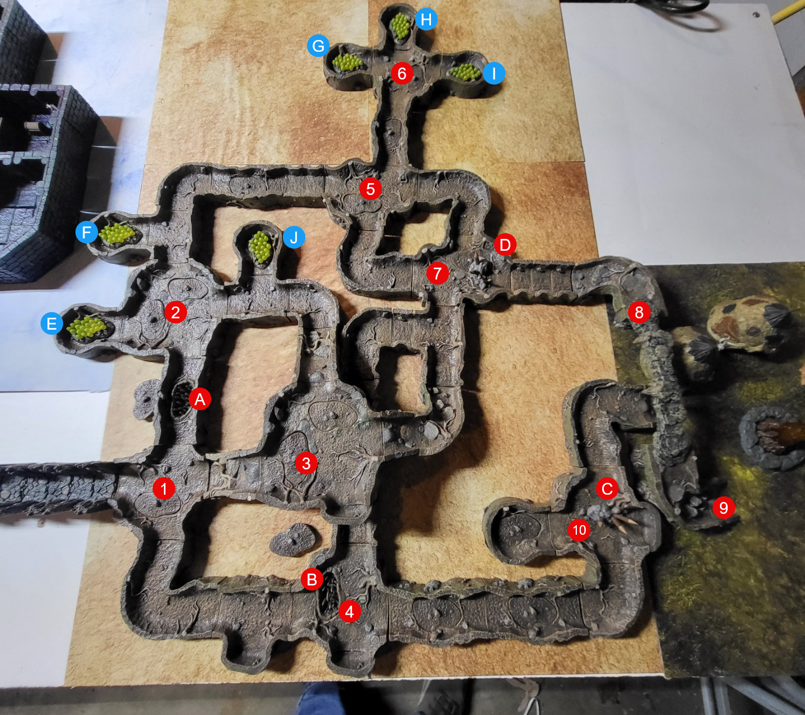

This tunnels are tight, damp, and dark. Most are only 3-4' tall, forcing taller players to crouch or crawl.. This reduces a players ability to defend or fight. The Goblins have dug smaller holes allowing them to pop out in in various places in the tunnels. They have also placed traps through out the dungeon. They fight in hit and run style tactics. 

**Note**: Popout tiles represent Goblin Attack Tunnel Entrance.. These are places the Goblins will pop out and pepper players with arrows/bolts. 

 1. Tunnel Entrance
 2. West Chamber
 3. Upper Chamber (where Rolling Stone came from. There is another large stone here.)
 4. South Chamber 
 5. North Chamber
 6. Harvest Room
 7. Northern Defense Chamber - Leading to Village
 8. Bridge
 9. Main Goblin Village Entrances
10. Southern Defense Chamber - leading to Village
    - Just off this chamber is a Fountain. This Goblins have poisoned this well. "Don't require roll until all players who plan to drink do so.. Then ask for a CON Save.. The effect will appear over time depending on results of CON Save. 

A/B - Spike Pit Traps
C/D - Goblin Defenses
E-J - Gas Plants used by Globlins for their gas weapons. Any open flame that nears these rooms will result in a Gas Explosion. 

> Under the pits are some treasure piles with other victims. 

Monsters:
- Goblin Warriors
- Goblin Archers
- Goblin Shaman (Healer/Caster)