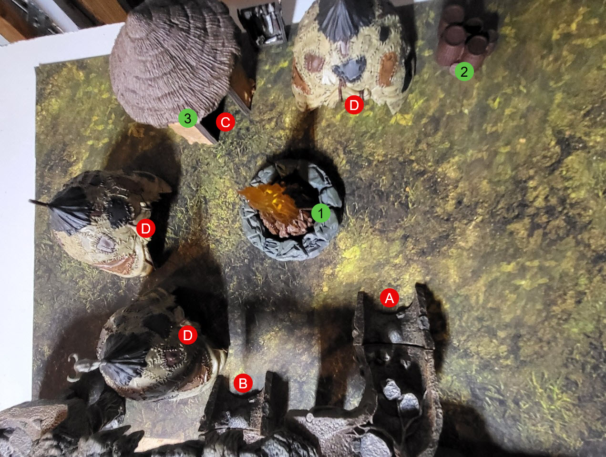

# The Goblins' Lair

This is the primary village of the Goblins. This is where their leader a Massive Hobgoblin keeps court over his minions. The Village is nestled in a massive underground chamber that appears to wet and muddy with space ffor growing food. The Goblins will fight to the death to protect their small home. 

The Hobgoblin has one of the crystals on his person. 
The large hut has a large stash of Treasure, Weapon and Supplies. 

A. Upper Tunnel Exit
B. Lower Tunnel Exit
C. Hobgoblin Cheif Hut
D. Goblin Huts

1. Firepit (remains of previous Adventures that were cooked.)
2. Supplies
3. Chiefs Treasure (including a few Magic Items)

Monsters:
- Hobgoblin Chief
- Goblin Warriors

