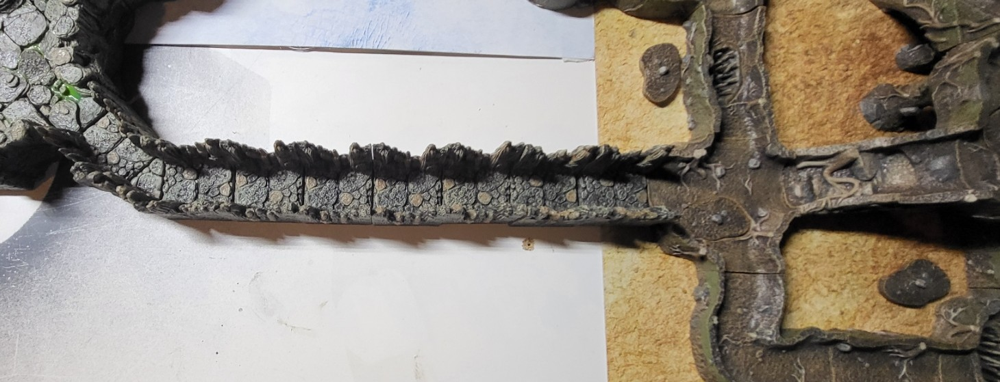

# Long Tunnel

Long Stone Tunel that leads to Goblin Tunnels, has uneven ground with thick vines covering the floor making the terrain difficult to cross quickly.

> Dwarves can tell the stone was worked vs being natural. there is also a very slight upward slope.. None Dwarves can make a perception check to figure this out.. This should give the players pause after the other traps they've encountered. 

TRAP: When players get about half way, they hear Goblins begin screaming followed by the sound of something MASSIVE rolling at them.. The Goblins will release a large Spherical Stone down the long tunnel to crush any player too slow.. 

