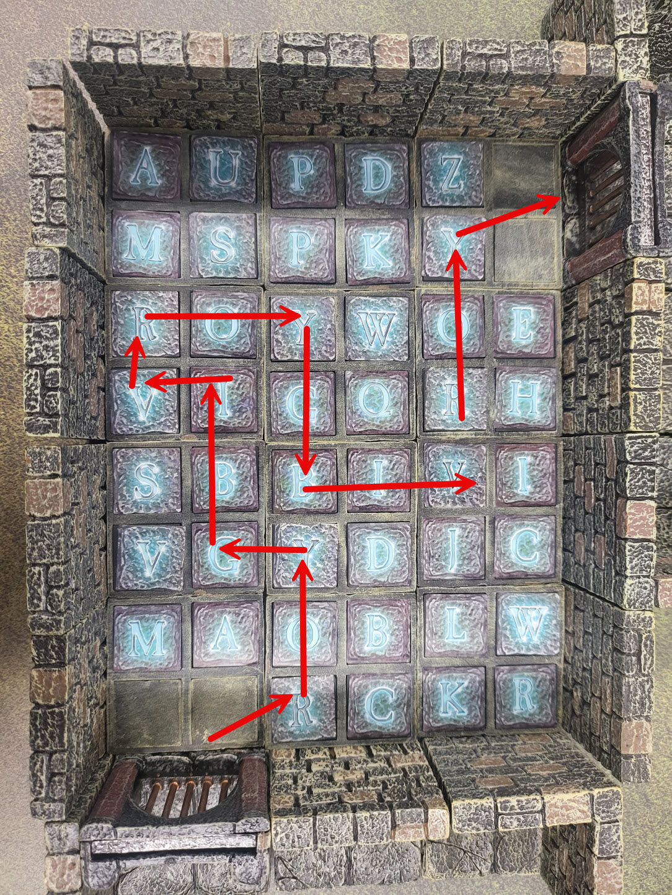

# The Rainbow Room

**Room Type:** Sequence Puzzle / Floor-Tile Trap  
**Reward:** Crystal shard (GM choice — recommended: a mid-tier color crystal) plus a small cache of consumables  
**Primary Threat:** Stepping on the wrong tile triggers a searing arcane discharge from the floor  
**Solution:** Cross the grid by stepping on the tiles whose letters spell **R-O-Y-G-B-I-V** — but the *word itself* is not given anywhere in this room. The party must arrive already knowing it from a clue found elsewhere in the dungeon.  

> **GM Only:** The red arrows on the floor in the image mark the single safe path. The path visits tiles lettered **R → O → Y → G → B → I → V** from the entry at the bottom to the exit at the upper right. Players never see these arrows — they see only a grid of carved letter tiles. Keep the map covered or angled away from the table.

## Room Description

### Read Aloud (Entry)

> The portcullis at your back drops with a clang of iron on stone. The room ahead is a flat grid of pale blue-grey tiles, each one carved with a single letter that glows faintly from within. Letters everywhere — no pattern you can see at a glance — six tiles across, eight tiles deep. A doorway waits in the far wall, sealed by a curtain of pale light through the bars.

A square chamber, roughly 35 ft × 40 ft. The entire floor is paved with a grid of identical stone tiles — six across, eight deep — each tile pale blue-grey, carved with a single capital letter that catches the light with a faint inner glow. The walls are dressed stone, plain and undecorated. The ceiling is low and unornamented. 

## The Trap

Stepping onto any wrong tile:

- **Lance of Light.** A vertical beam of searing prismatic light in every color of the rainbow erupts from the tile. The character on it makes a **DC 15 Dexterity save** — on a failure, **2d6+2 radiant damage** (half on success). The beam is visible to the whole room and lasts one round. /Mark with something

> A character reduced to 0 HP by a Lance is unconscious as normal; the body remains on the tile. Other PCs can attempt to drag them to an adjacent safe tile (one square of movement, DC 12 Athletics).

## Reaching the Exit

When the first character reaches the **V** tile and steps onto the landing, the exit opens automatically. It will ONLY open if the players step on tiles - they may not use other means to bypass the puzzle as it is the key that acutally unseals the door. 

