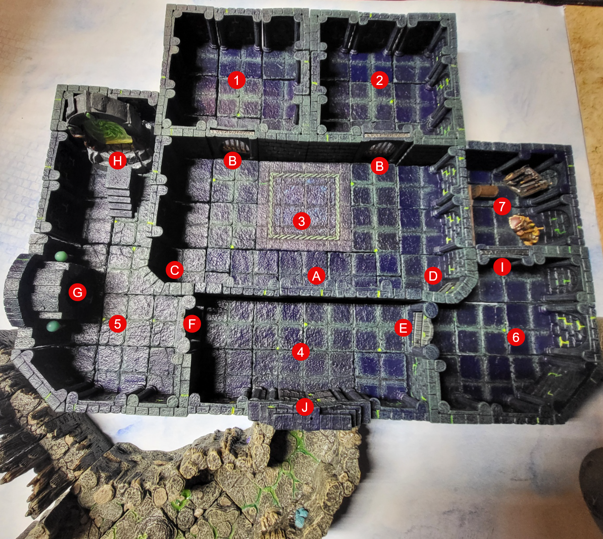

# The Cells

**Room Type:** Starting Puzzle / Resource Gate  
**Reward:** Basic supplies, first treasure tokens, first Scrying Stone clue  
**Primary Threat:** Time pressure, poor choices, and attrition before the dungeon even begins  
**Solution:** Escape the cells, recover the keys, gather supplies, and solve the vault lock sequence

- 1: Left Cell
  - B: Cell Door
- 2: Right Cell
  - B: Cell Door
- 3: Main Chamber
  - A: Key Trap Trigger/Keys
  - C: Door to Portal Room
  - D: Door to Left hall
- 4: Exit
  - E: Left Hall Door | Axe Trap
  - F: Portal Room Door | Axe Trap
  - J: Exit to Cavern
- 5: Portal Room
  - G: Scrying Stone
  - H: Dungeon Exit/Portal
- 6: Left Hall
  - I: Sealed door (puzzle to open)
- 7: Treasure Room

## Rooms

### Room 1 & 2 "The Cells" 

> Description | Two cells about 15' x 15' where players wake up on slick stone floors, with no memory of how they got there.. Each cell has a single cell door.. Through the door hanging just over 30' away are keys hanging on a hook. 

  - If Players search the cell DC12 Perception to notice deep scrapes in all the stone walls. The scrapes appear to go from ceiling to floor. 
  - DC16 Percepetion to have players notice what appears to be old dried blood traped in the spaces between the tiles on the floor. 

Trap: If the keys are lifted from the hook. Players hear an audible *click*, followed by grinding stone as the ceiling in both cells begins to lower. 

**Read Aloud (when triggered):**

> The keys come free — and somewhere above the cells, a faint *click,* then a long low grinding noise as old gears begin to turn. Dust drifts down from the seams in the ceiling. The stones are moving.

- **Type:** Mechanical, timed area trap (the two cells; the central corridor and the rest of the room are safe)
- **Trigger:** Lifting the key ring off the hook without first detecting and bypassing the wire
- **Detection:**
  - Perception DC 16 — spot the fine wire running from the back of the hook into the wall
  - Investigation DC 14 if a character specifically examines the hook
- **Disarm (before trigger):**
  - Thieves' Tools DC 14 — clip or pin the wire
  - Sleight of Hand DC 13 — slide a finger, stick, or wedge under the keys while lifting, to hold the hook depressed
  - Replace the weight of the keys with something equivalent (sock of pebbles, a tin cup of stones, etc.) — automatic success with a sensible plan
- **Disarm (after trigger):**
  - Put the keys back on the hook → mechanism halts immediately, full reset after 1 minute, can be bypassed properly during that window
  - Jam the descending ceiling with the rusted crowbar, a body, or cell bars — Athletics DC 15, buys 1 additional round
  - Find the hidden reset lever on the back wall of either cell — Investigation DC 16, action to throw it
  - **Combined Brace (cinematic option):** One character plants themselves directly under the descending ceiling and pushes up with everything they have — **DC 25 Strength save.** Any number of adjacent allies can use their action to brace alongside, and **each one adds their own Strength modifier** to the lead character's total. Roll once per round.
    - **Escalation:** Each subsequent round the bracers hold, the DC rises by **+2** (DC 25 → 27 → 29 → 31…). A new save is required at the start of each round to maintain the hold. Muscles tire, the mechanism keeps pushing, and the cost of holding goes up every time.
    - **Success:** The ceiling halts for that round. The brace must be maintained — every braced character is locked into the action and can do nothing else. If even one helper drops out, re-roll next round with the reduced total against the higher DC.
    - **Failure:** The brace collapses and the ceiling resumes its descent from wherever it was being held. **The failed save itself deals no damage.** Damage is taken only when (and if) the ceiling reaches a height that hurts the characters still under it, per the round-by-round table below. If the brace was holding the ceiling at floor-level when it fails, the result is exactly what you'd expect.
    - **Natural 20 on the lead's roll:** The mechanism jams. The ceiling stops entirely until the bracers release it, at which point the timer resumes from where it stopped (giving the rest of the party time to find the reset lever, clip the wire from below, or get everyone out).

**Movement under the descending ceiling:**

The cells are roughly 10 ft × 10 ft each, with a single barred door opening into the central corridor (which stays safe). While the trap is active:

- **Cell door bottleneck.** Only **one character can move through a cell door per round.** The opening is narrow and the descending ceiling makes it worse — only one crouched or prone figure can fit through at a time. Everyone else queues behind them and must wait their turn.
- **Crawling speed.** Once the ceiling is low enough to force a character to crawl, that character moves at **1/4 of their normal speed** (a 30 ft speed drops to 7.5 ft per move). The ceiling is pressing on their back; they cannot stand, they cannot Dash to double their speed, and pulling someone else along halves it again.

**Effect (round by round, starting the round AFTER the trigger):**

The ceiling begins at **7 ft** above the cell floor and descends **1 ft per round.**

| Round | Ceiling Height | Effect |
|-------|----------------|--------|
| 1 | 6 ft | Tall PCs (6 ft+) must stoop. Everyone else moves normally. No damage. |
| 2 | 5 ft | All Medium creatures must duck. Movement at half. No damage. |
| 3 | 4 ft | Hunched walk or crouch. Movement at half. No damage. |
| 4 | 3 ft | Must crawl. Movement at **1/4 speed.** No damage. |
| 5 | 2 ft | Prone crawl only. Movement at **1/4 speed.** No damage. |
| 6 | 1 ft | **4d6 bludgeoning** to anyone still in the cells. Dex save DC 14 for half. A creature reduced to 0 HP is pinned and dying, but can still be saved or pulled out by a teammate next round. |
| 7+ | Floor-level | **Everyone still in the cells is dead.** No saves, no rolls, no recovery. Just crushed. Bodies cannot be recovered until the mechanism is reset or disabled. |

**Escape pacing.** Each cell holds 3–6 prisoners. Combined with the one-per-round door bottleneck, the last PC out of a cell clears the doorway on the round equal to the cell's headcount. The math is unforgiving:

| PCs in cell | Last PC clears door at start of round… | State of the ceiling when they do |
|-------------|-----------------------------------------|------------------------------------|
| 3 | Round 4 | 3 ft — crawling, 1/4 speed |
| 4 | Round 5 | 2 ft — prone crawl, 1/4 speed |
| 5 | Round 6 | 1 ft — **takes 4d6 damage that round** |
| 6 | Round 7 | Floor — **dead, no save** |

This assumes a flawless evacuation: no looting, no panic, no helping a stuck ally, no failed actions, and the first PC moving on the very round the trap triggers. Any delay costs lives. The Combined Brace buys the rest of the party more time, but locks the bracers themselves under the ceiling. A fully-packed cell of six is essentially a death sentence without the brace, the reset lever, or putting the keys back on the hook.

### Room 3 "Freedom" 

> DESCRIPTION

### Room 4 "Exit to Cavern" 

> DESCRIPTION

### Trap: The Guillotine Door

A wall of rusted iron spikes is held flush against the ceiling inside the vault doorway, suspended by a hidden mechanism. A pressure tile in the threshold releases it the moment weight crosses the line.

**Read Aloud (when triggered):**

> A wet grinding sound from above — and then a wall of rusted spikes drops from the ceiling like a falling axe, dead-center through the doorway, aimed at chest and skull.

- **Type:** Mechanical, single-trigger
- **Trigger:** Anyone or anything crossing the doorway threshold before the trap is disabled, spotted and bypassed, or jammed
- **Detection (passive or active):**
  - Perception DC 14 — notice deep scoring in the stone floor at the threshold and a fine slot in the ceiling above
  - Investigation DC 13 if a character specifically examines the door frame
- **Disarm:**
  - Thieves' Tools DC 15 — wedge the release mechanism
  - Crowbar / spike / wedge driven into the ceiling slot — Athletics DC 13, takes 1 minute
  - A character aware of the trap can duck and roll under as they cross — advantage on the Dex save
- **Effect:** 4d6+4 piercing damage to any creature in the doorway when the spike wall falls. **Dex save DC 14 for half.** A creature reduced to 0 HP by this trap is impaled in place.
- **Aftermath:** The spike wall stays down, partially blocking the doorway. Survivors can crawl under or squeeze past at half movement. Lifting it out of the way takes Athletics DC 18 (or DC 13 with two or more characters working together).

- **Type:** Mechanical, timed area trap (the two cells; the central corridor and the rest of the room are safe)
- **Trigger:** Lifting the key ring off the hook without first detecting and bypassing the wire
- **Detection:**
  - Perception DC 16 — spot the fine wire running from the back of the hook into the wall
  - Investigation DC 14 if a character specifically examines the hook
- **Disarm (before trigger):**
  - Thieves' Tools DC 14 — clip or pin the wire
  - Sleight of Hand DC 13 — slide a finger, stick, or wedge under the keys while lifting, to hold the hook depressed
  - Replace the weight of the keys with something equivalent (sock of pebbles, a tin cup of stones, etc.) — automatic success with a sensible plan
- **Disarm (after trigger):**
  - Put the keys back on the hook → mechanism halts immediately, full reset after 1 minute, can be bypassed properly during that window
  - Jam the descending ceiling with the rusted crowbar, a body, or cell bars — Athletics DC 15, buys 1 additional round
  - Find the hidden reset lever on the back wall of either cell — Investigation DC 16, action to throw it
  - **Combined Brace (cinematic option):** One character plants themselves directly under the descending ceiling and pushes up with everything they have — **DC 25 Strength save.** Any number of adjacent allies can use their action to brace alongside, and **each one adds their own Strength modifier** to the lead character's total. Roll once per round.
    - **Escalation:** Each subsequent round the bracers hold, the DC rises by **+2** (DC 25 → 27 → 29 → 31…). A new save is required at the start of each round to maintain the hold. Muscles tire, the mechanism keeps pushing, and the cost of holding goes up every time.
    - **Success:** The ceiling halts for that round. The brace must be maintained — every braced character is locked into the action and can do nothing else. If even one helper drops out, re-roll next round with the reduced total against the higher DC.
    - **Failure:** The brace collapses and the ceiling resumes its descent from wherever it was being held. **The failed save itself deals no damage.** Damage is taken only when (and if) the ceiling reaches a height that hurts the characters still under it, per the round-by-round table below. If the brace was holding the ceiling at floor-level when it fails, the result is exactly what you'd expect.
    - **Natural 20 on the lead's roll:** The mechanism jams. The ceiling stops entirely until the bracers release it, at which point the timer resumes from where it stopped (giving the rest of the party time to find the reset lever, clip the wire from below, or get everyone out).

---

### Room 5 "Portal Room" 

> DESCRIPTION

### Room 6 "Left Hall" 

> DESCRIPTION

### Room 7 "Treasure Room" 

> DESCRIPTION

The stash sits in the corner of the outer chamber (position **#3** on the layout), visible from inside the cells through the bars. Once the party reaches the corner, they may recover the following:
- 2x Minor healing potions
- 1x Rope (20 ft)
- 1x Rusted crowbar
- 1x Chalk pouch
- 1x Flint and steel
- 1x Small pouch
- 4x Torches
- 1x Thieves tools
- Long Sword x1
- Short Sword x1
- Helm
- Sheild
- Short Bow + 20 Arrows
- 4x Daggers
- Leather Armor
- Scalemail Armor
- 25$ worth of coins

--- 

### GM Notes on the Traps

- **Telegraph both.** Describe the scoring on the stone at the doorway before anyone steps through. Describe a faint glint of wire on the key hook when anyone looks at the keys. Players who ignore an obvious tell have earned what happens next.
- **Same lesson, twice.** Both traps teach *check before you touch.* Anyone who survives this room should carry that habit into the rest of the dungeon — and anyone who doesn't, won't be making the trip.
- **One death here is appropriate.** Two is a dungeon-killer before the dungeon even starts. If the dice are cruel on the second trigger, leave the victim at 1 HP with a scar and a story instead of dropping them.
- **Bodies stay where they fall.** Impaled in the doorway. Crushed in the cells. 